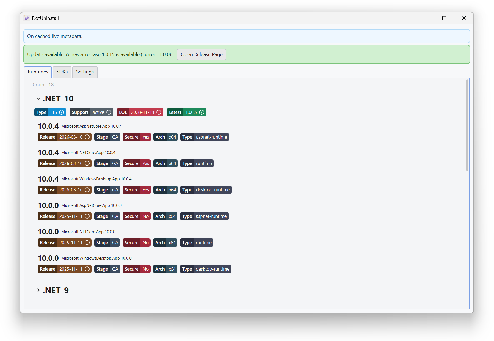
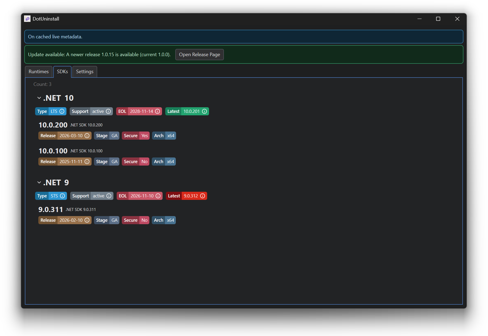
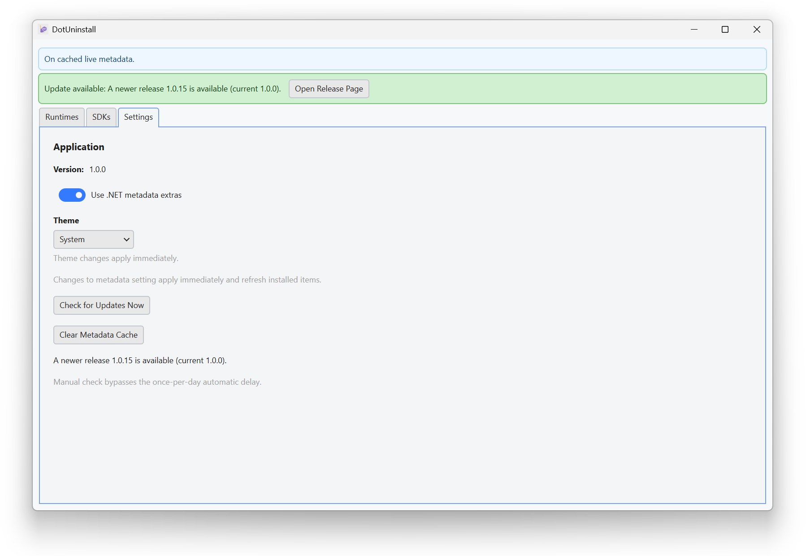
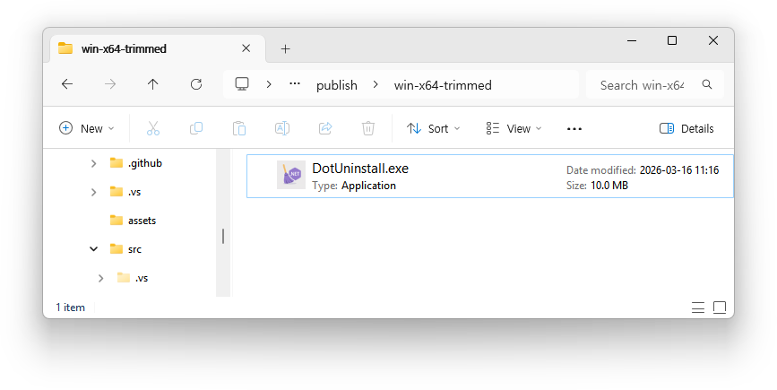

# DotUninstall.MewUI


A **MewUI port** of the original **DotUninstall** project.

This project provides a lightweight GUI for managing installed .NET SDKs and runtimes, built with **MewUI** instead of the original UI framework.

The goal of this port is to explore how existing .NET GUI utilities can be implemented with **MewUI and NativeAOT-friendly architecture**, while keeping the application small and dependency-light.

> [!IMPORTANT]  
> Includes examples of configuration for multi-platform NativeAOT builds in a single project (project file, startup code, and publish profiles).




 


The output size is 10 MB without JSON resources, with no runtime dependency required.

---
## Original Project

Original project:
DotUninstall

Repository:
[https://github.com/lextudio/DotUninstall](https://github.com/lextudio/DotUninstall)

The original application provides a graphical interface for Microsoft's **dotnet-core-uninstall** logic, allowing developers to view installed SDKs/runtimes and remove them safely. ([docs.lextudio.com][1])

This repository ports the UI layer to **MewUI** while preserving the core functionality.

## Purpose of This Port

This project exists primarily for:

* Testing **MewUI in real-world desktop tools**
* Evaluating **NativeAOT-friendly GUI application structure**
* Demonstrating how existing .NET tools can be ported to **lightweight UI frameworks**

It is **not intended to replace the original project**.

## Features

* View installed .NET SDKs
* View installed .NET runtimes
* Remove selected installations
* Lightweight GUI implementation with **MewUI**

## Differences from the Original

| Item          | Original                  | This Project                             |
| ------------- | ------------------------- | ---------------------------------------- |
| UI framework  | Uno Platform              | MewUI                                    |
| Runtime model | Standard .NET desktop app | Designed for lightweight distribution    |
| Purpose       | End-user tool             | Experimental port / framework validation |

## Build

```bash
dotnet build
```

Run:

```bash
dotnet run
```

## License

This repository follows the same licensing model as the original project where applicable.

Please refer to the original repository for details.

## Attribution

This project is based on:

* DotUninstall by Lex Li
* Microsoft `dotnet-core-uninstall`

All credit for the original design and functionality belongs to the original authors.
